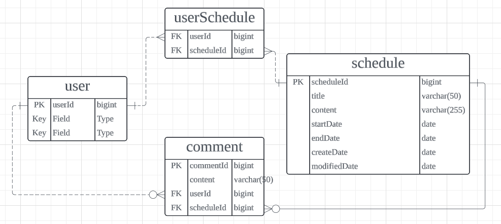

## 개인 과제 4: 일정 관리 앱 만들기

 

### 프로젝트 소개
- 일정 관리 앱은 사용자가 일정을 추가, 조회, 수정, 삭제하는 `RESTFUL API`를 구현하는 어플리케이션입니다.
- 지난 프로젝트와 비슷하지만, CRUD 기능은 모두 `JDBC`를 사용하는게 아닌 `JPA`를 사용합니다.
- `JPA의 연관 관계`, `영속성 전이`, `cascade` 등을 사용하여 `JPA`의 주요 기능을 적극적으로 사용합니다.
- `JWT`를 사용한 인증과 인가를 활용하여, 회원가입과 로그인을 구현하고 일정, 댓글에 대한 접근을 관리합니다.

 

### 프로젝트 조건
- `3 Layered Architectrue`에 따라 각 Layer의 목적에 맞게 구현합니다.
- 모든 테이블은 고유 식별자(ID)를 가집니다.
- 인증/인가 절차는 `JWT`를 활요합니다.
- `JPA의 연관 관계`는 `양방향`으로 구현합니다.
- `JDBC`, `Spring Security`를 사용하지 않습니다.

 

### 프로젝트 실행법
1. application.properties에서 mysql 설정에 맞게 아이디 비밀번호 설정
2. schedule_app DB를 생성 : `CREATE DATABASE schedule_app;`
3. 환경 변수에 MY_SECRET_KEY 추가하여 비밀키 추가(추가 후 IDE 어플리케이션 재실행)
4. postman으로 api명세서의 요청 형식에 맞춰서 요청
5. 인증 필요 시 Header에 Authorization 부분에 로그인 후 응답받아 사용, 이후 Header에 함께 요청 

 

### 필수 기능 구현
- #### Lv 0. API 명세 및 ERD 작성
  - #### [API 명세서](https://buttery-caravel-ad6.notion.site/schedule-app-11fe7b55e4d18052a596e4944281864a?pvs=4)

  - #### ERD 작성
        

 

- #### Lv 1. 일정 CRUD
  - 일정 저장, 조회, 수정, 삭제 기능 추가할 것
  - 일정을 삭제할 때 일정의 댓글도 함께 삭제 (`JPA 영속성 전이` 활용)

- #### Lv 2. 댓글 CRUD
  - 기 생성한 일정에 댓글 다는 기능 추가 (`연관 관계` 형성)
  - 댓글의 `CRUD`를 모두 구현
  - 댓글은 내용, 작성일, 수정일, 작성 유저명 필드를 가짐.
  - `JPA Auditing`을 활용하여 작성일, 수정일 필드를 관리 할 것.

- #### Lv 3. 일정 페이징 조회
  - `offset` / `limit` 을 활용하여 범위에 맞게 일정 조회기능 추가
  - `page`, `pageable` 인터페이스를 활용하여 페이지네이션 구현
  - 페이지 크기와 페이지 번호는 쿼리 파라미터를 통해 요청
  - 디폴트 페이지 크기는 10으로 설정
  - 할일 제목, 할일 내용, 댓글 개수, 일정 작성일, 일정 수정일, 일정 작성 유저명 필드를 조회

- #### Lv 4. 유저 CRUD
  - `JPA 지연 로딩` 활용할 것
  - 유저명, 이메일, 작성일, 수정일 필드를 가질 것
  - 유저 저장, 조회, 삭제 기능 추가
  - 일정은 이제 유저명 필드대신 유저 고유 식별자 필드를 가짐
  - 일정 - 유저 관계는 `N : M 관계`

- #### Lv 5. 다양한 예외처리 적용하기
  - validation을 활용하여 예외처리를 추가할 것.
  - 제목, 내용, 유저명 의 길이를 제한하고 예외사항을 지정해볼 것.
  - `@Pattern`을 사용해서 Email 형식 검증 등을 추가할 것.

 

### 도전 기능 구현
- #### Lv 1. JWT를 활용한 회원가입 만들기 
  - 유저에 비밀번호 필드 추가
  - 비밀번호는 암호화되어야 한다.
  - 회원가입 시 JWT를 발급 후 반환

- #### Lv 2. 로그인(인증)
  - 이메일과 비밀번호로 로그인 인증 기능 구현
  - 필터를 활용해 인증 처리 시키기
  - 토큰은 `Cookie`가 아닌 `Header`에서 처리
  - 로그인 요청과 회원가입 요청은 인증 필터에서 제외
  - ㅎ
  - 예외처리 
    - 이메일과 비밀번호가 일치하지 않을 경우 401 반환
    - 토큰이 없다면 400 반환
    - 유효기간이 만료된 토큰은 401반환

 

### 트러블 슈팅
[트러블 슈팅 관련 링크](https://velog.io/@hwk__/%EA%B0%9C%EC%9D%B8-%EA%B3%BC%EC%A0%9C-4-%ED%8A%B8%EB%9F%AC%EB%B8%94-%EC%8A%88%ED%8C%85.-Jwt%EC%8B%9C%ED%81%AC%EB%A6%BF%ED%82%A4%EC%99%80-%ED%99%98%EA%B2%BD%EB%B3%80%EC%88%98)

### 사용한 기술 스택
- Java, Spring Boot
- MySQL

### 주요 라이브러리
- Lombok: 보일러플레이트 코드를 줄이기 위한 라이브러리. 자동으로 getter, setter, 생성자 등을 생성.
- JPA: 자바에서 ORM을 위한 표준 API로 DB와 상호작용을 쉽게 도와줌
- Spring Web: 웹 애플리케이션을 위한 모듈로, RESTful API 개발을 지원
- MySQL Driver: MySQL DB와 JAVA APP과의 연결을 지원하는 드라이버
- validation: 객체의 필드에 대한 유효성 검사를 수행

### API 특징
- HTML 템플릿 없이 JSON 형식으로만 응답을 제공하는 RESTful API
- 로그인 한 유저의 브라우저 헤더에 JWT을 저장하여 인증/인가를 수행

### 구조
- `common` : 예외, 필터, JWT와 공통 설정을 담당
- `comment` : 댓글 관련 API
  - `controller` : 클라이언트 요청과 응답을 담당.
  - `service` : 비즈니스 로직을 담당.
  - `repository` : JPA 쿼리 메서드 방식으로 DB와 직접적인 상호작용을 담당
  - `dto` : 계층 간 필드에 담을 데이터들을 전달에 사용
- `entity` : 데이터베이스 테이블과 매핑되는 엔티티 클래스와 ENUM 클래스를 포함
- `schedule` : 일정 관련 API
  - `controller` : 클라이언트 요청과 응답을 담당.
  - `service` : 비즈니스 로직을 담당.
  - `repository` : JPA 쿼리 메서드 방식으로 DB와 직접적인 상호작용을 담당
  - `dto` : 계층 간 필드에 담을 데이터들을 전달에 사용
- `user` : 사용자 관련 API
  - `controller` : 클라이언트 요청과 응답을 담당.
  - `service` : 비즈니스 로직을 담당.
  - `repository` : JPA 쿼리 메서드 방식으로 DB와 직접적인 상호작용을 담당
  - `dto` : 계층 간 필드에 담을 데이터들을 전달에 사용

